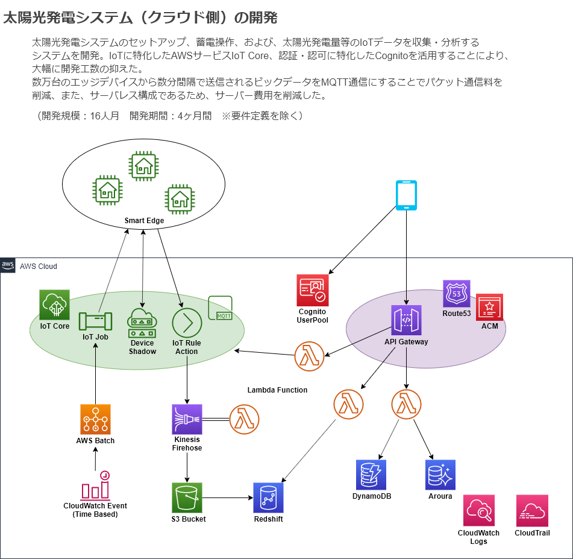

= スキルシート
:toc: left
:toclevels: 3

== 基本情報
氏名:: 山崎　雅人（やまざき　まさと）
年齢:: 25歳
性別:: 男
最寄駅:: JR山手線　田端駅

== 自己PR
これまで、保守、インフラ構築、実装、設計、要件定義、プリセールス、プロジェクトマネジメントなど、多岐に渡る仕事をしてきました。 +
特にAWSを強みにしており、
参画した全ての開発案件で、アーキテクチャー検討・インフラ構築・ローカル開発環境構築を担当しました。

業務の取り組み方に関しては、優先度やクリティカルパス、ビジネスインパクトを意識し、能動的に作業しています。

また、上手くいかなかった仕事については、失敗の原因分析や課題の本質を見極め、改善できるよう取り組んできました。 +
その中で大きな成果として、「社内開発案件の契約形態見直し」と「プロジェクト標準化」です。

NOTE: 「社内開発案件の契約形態見直し」「プロジェクト標準化」については、<<other_actual,その他の実績>>を参照ください。

実装に関しては、PythonやJava、ReactやC#など、多くのプログラミング言語を業務で使ってきました。 +
しかし、インフラ経験と比べると、経験が浅いと感じております。

私自身、まだまだ未熟だと感じており、これまで毎日の学習を継続してきました。 +
至らない点があるかと思いますが、絶え間ぬ努力をしていきますので、よろしくお願いいたします。

== 職務履歴
=== 1. _2018/03 ～ 現在_　請負開発チーム チームリーダー

==== 1-1. AWS × IoT × ビックデータ × サーバレス案件
NOTE: システム詳細は<<develop_actual,開発実績>>を参照ください。

.太陽光発電システム クラウド基盤
****
[.underline]#システム概要#::
* 太陽光発電システムのエッジデバイスをセットアップする機能（クラウド側）
* 太陽光発電システムをエッジデバイス経由で制御する機能（クラウド側）
* 太陽光発電システムの発電量・消費電量などをエッジデバイスより受信・蓄積する機能

[.underline]#参画期間#::
2019/03 ～ 2019/08

[.underline]#規模/開発者人数#::
400人日/6人

[.underline]#用いた技術要素#::
Python / Docker, Docker Compose / Amazon Batch / AWS IoT, Amazon DynamoDB, Amazon S3, AWS CloudFormation

[.underline]#自身の役割とミッション#::
プリセールス、要求・要件定義とアーキテクチャー検討をメインに担当しました。 +
クライアントは2年越しで太陽光発電システムを開発する計画をしており、段階的に基盤を作成していく方針でした。 +
今後拡大していく案件で、弊社が担当する開発範囲を広げ、更なる案件を獲得する役割を担いました。

[.underline]#主な作業内容と実績#::
太陽光発電システムのクラウド基盤とユーザー向けアプリの2つの開発案件を受注しました。 +
また、これらの開発は要件が複雑であったため、技術調査・要件定義を準委任で切り出した多段階契約で進めました。 +
 +
要件定義行程では、クライアントとの仕様調整を円滑に進めるために、業務理解を深めつつ、システム仕様だけでなく、業務仕様を含めた提案を実施した。
****

==== 1-2. 炎上案件
.前払い式決済システム 友達メッセージ機能
****
[.underline]#参画期間#::
2019/03 ～ 2019/06

[.underline]#自身の役割とミッション#::
当プロジェクトを担当していたプロジェクトマネージャーが退職され、これがきっかけでプロジェクトの問題が浮き彫りとなり、 +
マスタースケジュールから2ヶ月の遅延、残タスクが不明、仕様書がないなどの事態になっていました。 +
 +
この事態を対処するため、「太陽光発電システム クラウド基盤」案件と兼務で、当プロジェクトに参画することとなりました。

[.underline]#主な作業内容と実績#::
主に、下記の作業を行い、プロジェクト完了することができました。
. 現状の調査、残タスクの洗い出し、必要工数の積算
. 開発体制の立て直し、開発メンバーの調達
. クライアントへの現状説明とスケジュール調整
. タスク管理表及びWBS作成
****

=== 2. _2018/11 ～ 現在_　プリセールスチーム（兼任）
"請負開発チーム"と兼任で、"プリセールスチーム"に参加しました。 +
主に、IoT、ビックデータ、AWSに関連する開発案件の見積り・提案を担当しました。

見積作業では、より精度の高い工数を算出するために、下記の作業を事前に行うなどの工夫をしました。

* システム構成図を概要レベルで作成
* 業務フロー図を概要レベルで作成
* 画面遷移図を概要レベルで作成

上記作業を実施しても、クライアントの要求が不明瞭で、仕様検討にリスクがある場合は、下記の対応しました。 +
-> この対応を成功事例とし、「社内開発案件の契約形態の見直し」で社内ルールを設けました。

* 要件定義工程を業務委託契約で行い、要件定義完了後、再見積を実施する。
* 業務委託契約で作業を契約する。

=== 3. _2018/10 ～ 2019/02_　請負開発チーム
"請負開発チーム"（通称、特命チーム）に参加しました。 +
IoT、ビックデータ、AWSに関連する請負案件に参画し、AWS技術リード・インフラ責任者/SE/PGの役割を担いました。

==== 3-1. AWS × ビックデータ案件
.入力フォーム最適化・アクセス分析サービス
****
[.underline]#システム概要#::
* Form画面からAWSクラウドに蓄積された測定値を集計するDailyバッチ
* 集計したデータをレポート表示するWebアプリ

[.underline]#参画期間#::
2019/02 ～ 2019/03

[.underline]#用いた技術要素#::
Amazon ECS（Fargate）, Amazon S3, Amazon Athena, Python, Docker, AWS CloudFormation

[.underline]#自身の役割とミッション#::
当プロジェクトは、技術的課題を抱えており、この課題を解決するために、AWS技術リードとして途中参画しました。

[.underline]#実績#::
Dailyバッチの集計対象データがビックデータであり、これが理由でバッチ処理が要求する時間内に終わらないという課題がありました。
この課題を、をAWS Fargateを用いて、1万個のコンテナで並列処理するアーキテクチャーにすることで、解決する至りました。
****

==== 3-2. AWS × IoT × ビックデータ案件
.保険加入者向けドライブレコーダーシステム コンシューマー向け運転診断レポート機能
****
[.underline]#システム概要#::
* クラウドに蓄積されたIoTビックデータをレポート用に集計・加工するバッチ
* バッチで集計されたデータを基に、レポートに表示する動的画像を作成し、レポート画面を返すWebアプリ
* ブラウザ、スマホ対応のレポート画面

[.underline]#参画期間#::
2018/10 ～ 2019/02

[.underline]#用いた技術要素#::
Java, SpringBoot, Bootstrap, JavaScript, JQuery, C#, Amazon EC2, AWS Batch, Amazon RDS, AWS CloudFormation, Ansible, Vagrant, VirtualBox

[.underline]#主な作業内容#::
当プロジェクトでは、下記を担当した。
* アーキテクチャーの検討・インフラ構築
* API, Webアプリの設計、実装・テスト、結合試験、性能試験

[.underline]#実績#::
当プロジェクトは、C#で実装されたWindowsアプリをWebサービスとして作り直すプロジェクトでした。 +
この既存アプリは、ドキュメントがなく、かつ、バグが多いアプリであり、これが原因で、スケジュールが2ヶ月遅れとなりました。 +
 +
しかし、クライアントへのきめ細かな連携により、クライアントの理解を得ながら無事納品することができました。 +
クライアント対応はプロジェクトマネージャーが行っておりましたが、プロジェクトマネージャーへの密な連携と対応方法の提案などを行いました。
****

=== 4. _2017/12 ～ 2018/10_　インフラ・保守チーム
下記の2つが、インフラ・保守チームのミッションとなります。

. 保守契約をしている全サービスの保守・運用
. 請負案件のインフラ技術支援、アーキテクチャー検討・インフラ構築

==== 4-1. 保守契約をしている全サービスの保守・運用
保守契約をしている案件全てがAWSを基盤としているシステムであり、ネットワーク、システム、アプリと全てを保守対象でした。
そのため、幅広く、かつ深い知識を習得することができました。

用いた技術要素::
*AWS* +
EC2, Lambda, S3, DynamoDB, RDS, ElastiCache, API Gateway, CloudFront, ELB, Route53, SNS, SQS, Auto Scalling, CloudFormation, CloudWatch, Cognito, Kinesis, Redshift +
 +
*プログラミング言語* +
Java（SpringBoot）, Python, JavaScript
 +
*OS* +
AmazonLinux, CentOS, Ubuntu +
 +
*Webサーバー* +
Apache +
 +
*DB* +
MySQL, PostgreSQL, Treasure Data +
 +
*仮想化* +
Vagrant, VirtualBox +
 +
*管理系* +
Git, CloudFormation, Ansible

==== 4-2. 請負案件のインフラ技術支援、アーキテクチャー検討・インフラ構築
保守・運用で培ったAWSの知識を用いて、インフラ技術支援、アーキテクチャー検討・インフラ構築をしてきました。 +
当時、AWSができるエンジニアはインフラ・保守チームにしかおらず、このチームが社内の開発案件のインフラ部分を支えておりました。

[[develop_actual]]
== 開発実績
=== 太陽光発電システム クラウド基盤

[[other_actual]]
== その他実績
=== 社内開発案件の契約形態見直し
これまでの請負案件は、要求・仕様が不明瞭でありながら、要件定義からの一括で請負していました。 +
要求・仕様が不明瞭であるため、開発工数が肥大化し、赤字案件を多く生み出していました。 +
これらの問題を解決するために、要件定義フェーズのみ切り出す多段階契約や、それでもリスクを拭えない案件は業務委託契約にするなど、案件の特性にあわせた契約体形にする働きかけを行ってきました。

=== プロジェクト標準化
プロジェクトにおける、成果物のクオリティや、プロジェクトマネジメント力は、参画するメンバーに依存していました。 +
そのため、プロジェクトによっては、成果物がクオリティが低かったり、プロジェクトマネジメントが悲惨だったりしていました。

これらの問題を解決するために、社内に散在しているナレッジを一箇所に集約し、これを全社に展開しました。 +
具体的には、下記の作業を行いました。

* マネジメントの手引きを作成
* マネジメントに関するツールを整備
* 成果物のテンプレート、成果物の例を用意
